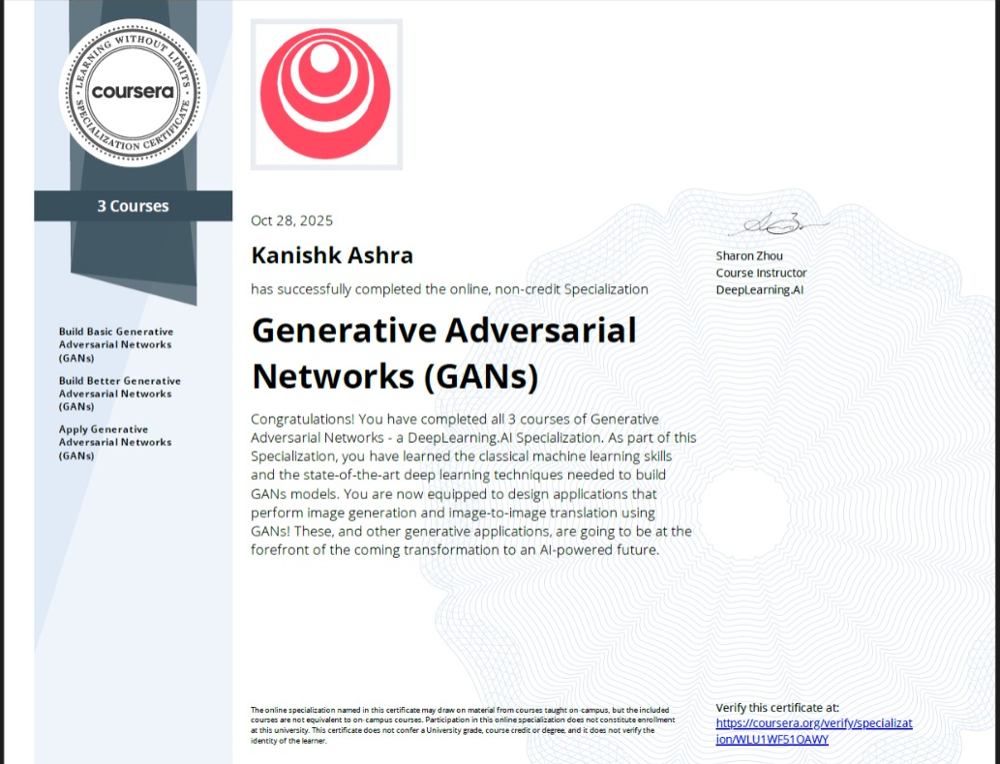
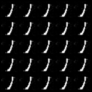
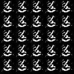

# Conditional GAN (CGAN) on MNIST



## Overview

This repository demonstrates a **Conditional Generative Adversarial Network (CGAN)** trained on the MNIST dataset. The project was developed as a **practical implementation** for the DeepLearning.AI [Generative Adversarial Networks (GANs) Specialization](https://www.deeplearning.ai/courses/generative-adversarial-networks-gans/) completed on **Oct 28, 2025**.

With this project, I implemented:

- Digit-specific image generation using CGAN.
- Visualization of **generator** and **discriminator losses** during training.
- Optional latent space interpolation between digits.

This work **reinforces my understanding of GAN architectures**, adversarial training, and generative modeling — skills directly applicable to my upcoming research on **EGEAT (Exact Geometric Ensemble Adversarial Training)** for robust deep learning.

---

## 📂 Repository Structure
cgan-mnist/
├── README.md
├── LICENSE
├── requirements.txt
├── config.py
│
├── src/
│ ├── init.py
│ ├── train.py
│ ├── generate.py
│ ├── utils.py
│ └── models/
│ ├── init.py
│ ├── generator.py
│ └── discriminator.py
│
├── checkpoints/ # Trained weights
│ └── generator_epoch_020.pth
│
├── results/
│ ├── samples/ # Generated images
│ │ ├── custom_digit_3.png
│ │ ├── custom_digit_7.png
│ │ └── latent_interp_3_7.png
│ └── training_log.csv # Training metrics
│
└── notebooks/
└── cgan_mnist_analysis.ipynb


---

## 📈 Results

**Generated Samples by Digit**

| Digit 3 | Digit 7 |
|---------|---------|
|  |  |

**Latent Space Interpolation**

Interpolating between 3 → 7:


**Training Loss Curves**

Loss curves (discriminator vs. generator):


---

## ⚡ Quick Start

1. Clone the repository:

```bash
git clone https://github.com/yourusername/cgan-mnist.git
cd cgan-mnist
