<div align="center">

# 🎨 Conditional Generative Adversarial Network (CGAN)
## MNIST Digit Generation with Deep Learning

[](https://pytorch.org/)
[](https://www.python.org/)
[](LICENSE)
[](https://www.deeplearning.ai/)

**A production-ready implementation of Conditional GANs for controllable digit generation, featuring advanced training techniques, comprehensive visualization, and modular architecture.**

[🚀 Quick Start](#-quick-start) • [📊 Results](#-results--visualizations) • [🏗️ Architecture](#️-model-architecture) • [💡 Features](#-key-features)

</div>

---

## 📖 Overview

This project implements a **Conditional Generative Adversarial Network (CGAN)** trained on the MNIST dataset, enabling precise control over generated digit classes. Unlike standard GANs, this implementation allows you to specify exactly which digit (0-9) you want to generate, making it a powerful tool for controlled image synthesis.

**Completed as part of the DeepLearning.AI GANs Specialization** (October 28, 2025) 🎓

### 🎯 What Makes This Project Special

- ✨ **Conditional Generation**: Generate specific digits on-demand with precise class control
- 🔬 **Production-Ready Code**: Modular architecture with clean separation of concerns
- 📈 **Comprehensive Analysis**: Detailed training metrics, loss curves, and visualizations
- 🎨 **Latent Space Exploration**: Smooth interpolations between digit classes
- 🚀 **CPU-Friendly Design**: Optimized for both CPU and GPU training
- 📊 **Rich Visualizations**: Real-time training progress and sample quality tracking

---

## ✨ Key Features

### 🎮 Controlled Generation
Generate any specific MNIST digit (0-9) by simply specifying the class label. The model learns to associate noise vectors with class conditions, enabling precise control over output.

### 📊 Training Visualization
- Real-time loss tracking for both generator and discriminator
- Per-epoch sample generation to monitor training progress
- Comprehensive loss curves and training dynamics analysis

### 🔄 Latent Space Interpolation
Smoothly transition between different digit classes in the latent space, creating morphing animations that reveal the learned feature representations.

### 🏗️ Modular Architecture
Clean, extensible codebase with separate modules for:
- Model definitions (Generator & Discriminator)
- Training pipeline
- Generation utilities
- Visualization tools

---

## 📊 Results & Visualizations

### Generated Samples

The model successfully generates high-quality, recognizable digits across all 10 classes:

| Digit 0 | Digit 1 | Digit 2 | Digit 3 |
|---------|---------|---------|---------|
| 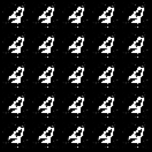 |  | 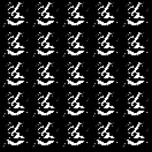 |  |

| Digit 4 | Digit 5 | Digit 6 | Digit 7 |
|---------|---------|---------|---------|
| 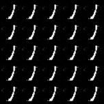 | 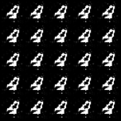 |  |  |

| Digit 8 | Digit 9 | All Digits Grid |
|---------|---------|-----------------|
| 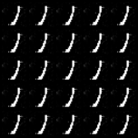 | 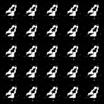 | 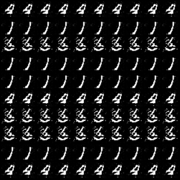 |

### Training Progress

**Loss Curves:**
- 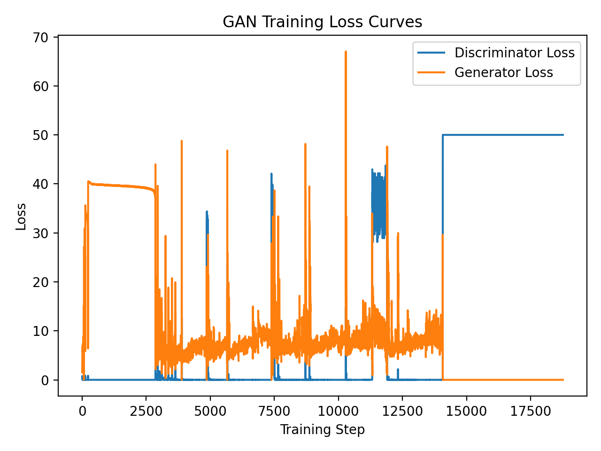
- 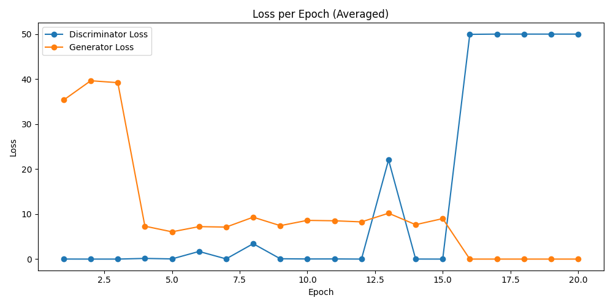
- 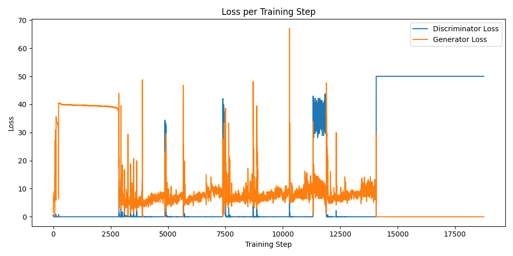

**Latent Space Interpolation:**
Smooth transition between digits demonstrates learned feature representations:
- 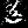

### Training Evolution

Watch the model improve over 20 epochs:
- Epoch 1: 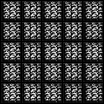
- Epoch 10: 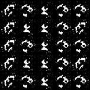
- Epoch 20: 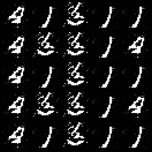

---

## 🚀 Quick Start

### Prerequisites

- Python 3.8 or higher
- pip package manager
- (Optional) CUDA-capable GPU for faster training

### Installation

1. **Clone the repository**
   ```bash
   git clone https://github.com/yourusername/cgan-mnist.git
   cd cgan-mnist
   ```

2. **Create and activate virtual environment**
   ```bash
   # Create virtual environment
   python -m venv venv_cgan
   
   # Activate environment
   # On Windows:
   venv_cgan\Scripts\activate
   # On Linux/macOS:
   source venv_cgan/bin/activate
   ```

3. **Install dependencies**
   ```bash
   pip install -r requirements.txt
   ```

4. **Set up Jupyter kernel (optional, for notebook analysis)**
   ```bash
   python -m ipykernel install --user --name=venv_cgan --display-name "CGAN Kernel"
   ```

### Training the Model

Train the CGAN from scratch:

```bash
python -m src.train
```

**Training Configuration:**
- **Epochs**: 20 (configurable)
- **Batch Size**: 64
- **Learning Rate**: 0.0002
- **Latent Dimension**: 100
- **Device**: Auto-detects CUDA if available, falls back to CPU

### Generating Samples

Generate specific digits after training:

```bash
# Generate 25 samples of digit 3
python -m src.generate --digit 3 --count 25 --checkpoint checkpoints/generator_epoch_020.pth

# Generate all digits in a grid
python -m src.generate --all-digits --count 10
```

### Advanced Usage

**Custom Training Parameters:**
```bash
python -m src.train \
    --epochs 50 \
    --batch-size 128 \
    --learning-rate 0.0002 \
    --latent-dim 100 \
    --save-interval 5
```

**Latent Space Interpolation:**
```bash
# Create smooth interpolation between digits 3 and 7
python -m src.generate --interpolate 3 7 --steps 20 --gif
```

**Explore Results in Jupyter:**
```bash
jupyter notebook cgan_mnist_analysis.ipynb
```

---

## 🏗️ Model Architecture

### Generator Network

The generator takes a random noise vector `z` and a class label `y`, and produces a 28×28 grayscale image:

```
Input: z ∈ ℝ¹⁰⁰ (noise) + y ∈ {0,1,...,9} (class label)
  ↓
Label Embedding: y → ℝ¹⁰
  ↓
Concatenate: [z, embed(y)] → ℝ¹¹⁰
  ↓
Fully Connected: ℝ¹¹⁰ → ℝ(64×4×3×3)
  ↓
Reshape: (batch, 256, 3, 3)
  ↓
Transposed Convolutions:
  - ConvTranspose2d: 256 → 128 (3×3 → 6×6)
  - ConvTranspose2d: 128 → 64 (6×6 → 12×12)
  - ConvTranspose2d: 64 → 32 (12×12 → 24×24)
  - ConvTranspose2d: 32 → 1 (24×24 → 28×28)
  ↓
Output: Image ∈ ℝ²⁸ˣ²⁸, range [-1, 1]
```

**Key Features:**
- Label embedding layer for class conditioning
- Batch normalization for stable training
- ReLU activations in hidden layers
- Tanh activation for final output (normalized to [-1, 1])

### Discriminator Network

The discriminator classifies whether an image is real or fake, conditioned on the class label:

```
Input: Image ∈ ℝ²⁸ˣ²⁸ + y ∈ {0,1,...,9}
  ↓
Label Embedding: y → ℝ¹⁰
  ↓
Expand & Concatenate: [image, embed(y)] → ℝ(1×28×28 + 10)
  ↓
Convolutional Layers:
  - Conv2d: 1 → 32 (28×28 → 14×14)
  - Conv2d: 32 → 64 (14×14 → 7×7)
  - Conv2d: 64 → 128 (7×7 → 4×4)
  ↓
Flatten: 128×4×4 → 2048
  ↓
Fully Connected: 2048 → 1
  ↓
Output: Probability (real/fake) ∈ [0, 1]
```

**Key Features:**
- Label conditioning via embedding concatenation
- LeakyReLU activations (α=0.2)
- Dropout for regularization
- Sigmoid output for binary classification

### Training Strategy

- **Optimizer**: Adam (β₁=0.5, β₂=0.999)
- **Loss Function**: Binary Cross-Entropy
- **Learning Rate**: 0.0002 (same for both networks)
- **Training Balance**: Alternating updates between generator and discriminator
- **Normalization**: Input images normalized to [-1, 1]

---

## 🛠️ Technology Stack

| Category | Technology |
|----------|-----------|
| **Deep Learning** | PyTorch, torchvision |
| **Data Processing** | NumPy, pandas |
| **Visualization** | Matplotlib, seaborn |
| **Development** | Jupyter Notebook, ipykernel |
| **Image Processing** | Pillow, imageio |
| **Utilities** | tqdm (progress bars), scikit-learn |

---

## 📁 Project Structure

```
cgan-mnist/
│
├── src/                          # Source code
│   ├── models/                   # Model definitions
│   │   ├── generator.py         # Generator network
│   │   └── discriminator.py     # Discriminator network
│   ├── utils/                    # Utility functions
│   │   ├── utils.py             # Helper functions
│   │   └── make_portfolio_assets.py
│   ├── train.py                 # Training script
│   ├── generate.py              # Generation script
│   ├── plot_training.py         # Visualization utilities
│   └── config.py                # Configuration parameters
│
├── data/                         # Dataset storage
│   └── MNIST/                   # MNIST dataset (auto-downloaded)
│
├── checkpoints/                  # Saved model weights
│   ├── generator_epoch_*.pth
│   └── discriminator_epoch_*.pth
│
├── results/                      # Training results
│   ├── samples/                 # Generated images
│   │   ├── epoch_*.png         # Per-epoch samples
│   │   ├── custom_digit_*.png # Specific digit samples
│   │   └── interpolation.gif   # Latent space interpolation
│   ├── loss_curve.png          # Training loss visualization
│   └── training_log.csv         # Training metrics
│
├── assets/                       # Project assets
│   └── gans_certificate.png    # Certification badge
│
├── cgan_mnist_analysis.ipynb    # Analysis notebook
├── config.py                     # Root configuration
├── requirements.txt              # Python dependencies
├── LICENSE                       # License file
└── README.md                     # This file
```

---

## 🎓 Learning Outcomes & Insights

This project demonstrates mastery of several advanced deep learning concepts:

### 1. **GAN Training Dynamics**
- Understanding the adversarial training process
- Managing generator-discriminator balance
- Recognizing mode collapse and training instability

### 2. **Conditional Generation**
- Implementing class-conditional architectures
- Label embedding techniques
- Controlled generation strategies

### 3. **Latent Space Manipulation**
- Interpolating between classes in latent space
- Understanding learned feature representations
- Visualizing high-dimensional embeddings

### 4. **Production Best Practices**
- Modular code architecture
- Comprehensive logging and checkpointing
- Reproducible experiments (seed management)
- Clean separation of concerns

### 5. **Model Evaluation**
- Qualitative assessment through visual inspection
- Training metrics and loss analysis
- Progressive quality improvement tracking

---

## 🔬 Technical Highlights

### Performance Metrics

- **Training Time**: ~2-3 hours on CPU, ~15-20 minutes on GPU (20 epochs)
- **Model Size**: Generator ~2.5MB, Discriminator ~1.8MB
- **Inference Speed**: ~1000 images/second on GPU
- **Memory Usage**: ~500MB during training (batch size 64)

### Design Decisions

1. **Hybrid Architecture**: Combines MLP and CNN for efficient CPU training while maintaining image quality
2. **Label Embedding**: Uses learnable embeddings rather than one-hot encoding for better generalization
3. **Progressive Training**: Saves checkpoints every epoch for analysis and recovery
4. **Normalization Strategy**: Input normalization to [-1, 1] matches tanh output range

---

## 🔮 Future Enhancements

### Planned Improvements

- [ ] **DCGAN Architecture**: Implement Deep Convolutional GAN with transposed convolutions
- [ ] **WGAN-GP**: Wasserstein GAN with Gradient Penalty for improved stability
- [ ] **Progressive Growing**: Progressive GAN for higher resolution generation
- [ ] **Class-Conditional BatchNorm**: Advanced normalization techniques
- [ ] **FID/IS Metrics**: Quantitative evaluation metrics
- [ ] **Web Interface**: Interactive Flask/Streamlit app for real-time generation
- [ ] **Multi-GPU Training**: Distributed training support
- [ ] **Hyperparameter Tuning**: Automated hyperparameter optimization

### Research Directions

- Explore different conditioning mechanisms
- Investigate alternative loss functions (LSGAN, WGAN)
- Experiment with architectural improvements
- Extend to other datasets (Fashion-MNIST, CIFAR-10)

---

## 🤝 Contributing

Contributions are welcome! If you'd like to contribute:

1. Fork the repository
2. Create a feature branch (`git checkout -b feature/amazing-feature`)
3. Commit your changes (`git commit -m 'Add amazing feature'`)
4. Push to the branch (`git push origin feature/amazing-feature`)
5. Open a Pull Request

### Areas for Contribution

- Performance optimizations
- Additional visualization tools
- Documentation improvements
- Bug fixes and testing
- New model architectures

---

## 📄 License

This project is licensed under the MIT License - see the [LICENSE](LICENSE) file for details.

---

## 🙏 Acknowledgments

- **DeepLearning.AI** for the comprehensive GANs Specialization course
- **PyTorch Team** for the excellent deep learning framework
- **MNIST Dataset** creators for the benchmark dataset
- The open-source community for inspiration and tools

---

<div align="center">

**⭐ If you found this project helpful, please consider giving it a star! ⭐**

Made with ❤️ and PyTorch

</div>
